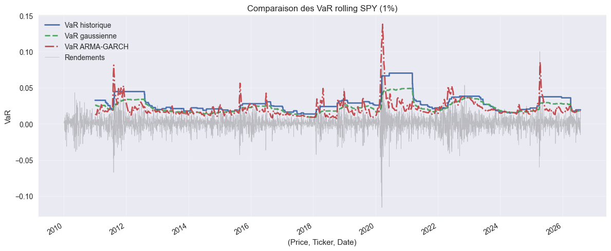

# BETHES-DA

**Estimation et backtesting rigoureux de la Value-at-Risk sur actions — GARCH, VaR/ES multi-méthodes, tests de Kupiec & Christoffersen.**



---

## 🇫🇷 Version française

### Aperçu

BETHES-DA mesure et **valide** le risque de marché d'un actif (SPY, ETF répliquant le S&P 500) sur la période 2010–2026. Le projet ne se contente pas de calculer une VaR : il vérifie statistiquement si cette VaR est fiable, exactement comme le ferait une équipe de model validation en banque.

Trois briques :
1. **Modélisation de la volatilité** — GARCH(1,1) et ARMA(1,1)-GARCH(1,1) sur les rendements logarithmiques.
2. **Estimation du risque** — VaR et Expected Shortfall (ES) selon 4 approches : historique, paramétrique normale, paramétrique Student-t, Monte Carlo à partir de la prévision GARCH.
3. **Backtesting** — VaR *rolling* (fenêtre 252 jours) comparée aux rendements réalisés, puis validation par les **tests de Kupiec** (couverture non conditionnelle) et de **Christoffersen** (indépendance des dépassements).

### Résultat clé

Sur 3 916 jours de trading SPY, à un seuil de confiance de 99% :

| Méthode | Dépassements observés | Dépassements attendus | p-value Kupiec | p-value Christoffersen |
|---|---|---|---|---|
| VaR historique | **60** | 39.2 | **0.0019** | 0.000028 |
| VaR gaussienne | **105** | 39.2 | **< 0.0001** | 0.000109 |

**Les deux modèles sont rejetés** par le test de Kupiec au seuil de 5% : ils sous-estiment significativement le risque de queue. Le test de Christoffersen montre en plus que ces dépassements ne sont **pas indépendants dans le temps** — ils se regroupent lors des épisodes de stress, signe classique de *volatility clustering* qu'un modèle gaussien statique ne peut pas capturer. C'est une preuve empirique concrète que les rendements actions ont des queues plus épaisses que ne le suppose l'hypothèse de normalité, et que la VaR gaussienne est particulièrement dangereuse à utiliser telle quelle.

### Structure du projet

```
BETHES-DA/
├── src/
│   ├── data_fetch.py         # Téléchargement des prix SPY (Yahoo Finance)
│   ├── volatility_risk.py    # GARCH / ARMA-GARCH + VaR/ES (4 méthodes)
│   └── backtesting.py        # VaR rolling + tests de Kupiec & Christoffersen
├── notebooks/
│   └── 01_eda.ipynb          # Exploration des rendements et de la volatilité
├── reports/
│   └── figures/
│       └── var_backtest_comparison.png
├── data/
│   └── var_backtest_results.csv
├── tests/
│   └── test_risk_metrics.py
├── requirements.txt
└── LICENSE
```

### Installation

```bash
git clone <url-du-dépôt>
cd BETHES-DA
python -m venv venv
source venv/bin/activate        # Windows : venv\Scripts\activate
pip install -r requirements.txt
```

### Utilisation

```bash
# 1. Télécharger les données SPY
python src/data_fetch.py

# 2. Calculer VaR/ES (historique, gaussienne, Student-t, Monte Carlo GARCH)
python src/volatility_risk.py
python src/volatility_risk.py --arma-garch      # variante ARMA(1,1)-GARCH(1,1)

# 3. Backtester la VaR (tests de Kupiec & Christoffersen)
python src/backtesting.py
python src/backtesting.py --skip-arma-garch     # backtest plus rapide
```

### Tests

```bash
pytest tests/
```

Les tests vérifient que les estimateurs VaR/ES retombent bien sur leurs formules analytiques de référence, et que les tests de Kupiec acceptent un modèle correctement calibré tout en rejetant un modèle qui sous-estime le risque.

### Stack technique

Python · pandas · NumPy · SciPy · statsmodels (GARCH/ARIMA) · yfinance · Matplotlib · pytest

### Limites & pistes d'amélioration

- Actif unique (SPY) — étendre à un portefeuille multi-actifs avec VaR de portefeuille (corrélations, copules).
- Pas de coûts de transaction ni de liquidité dans le backtest.
- Ajouter un test de Basel *traffic light* (zones verte/jaune/rouge) pour formaliser la décision de validation du modèle.

---

## 🇬🇧 English version

### Overview

BETHES-DA measures **and validates** the market risk of an equity asset (SPY, an S&P 500 ETF) over 2010–2026. The project doesn't just compute a Value-at-Risk — it statistically checks whether that VaR can be trusted, the same way a model validation team would in a bank.

Three building blocks:
1. **Volatility modelling** — GARCH(1,1) and ARMA(1,1)-GARCH(1,1) on log-returns.
2. **Risk estimation** — VaR and Expected Shortfall (ES) under 4 approaches: historical, parametric normal, parametric Student-t, and Monte Carlo from the GARCH forecast.
3. **Backtesting** — rolling VaR (252-day window) compared against realized returns, validated with the **Kupiec test** (unconditional coverage) and the **Christoffersen test** (independence of exceptions).

### Key result

Over 3,916 SPY trading days, at a 99% confidence level:

| Method | Observed exceptions | Expected exceptions | Kupiec p-value | Christoffersen p-value |
|---|---|---|---|---|
| Historical VaR | **60** | 39.2 | **0.0019** | 0.000028 |
| Gaussian VaR | **105** | 39.2 | **< 0.0001** | 0.000109 |

**Both models are rejected** by the Kupiec test at the 5% level: they significantly underestimate tail risk. The Christoffersen test further shows these exceptions are **not independent over time** — they cluster during stress episodes, a classic sign of volatility clustering that a static Gaussian model cannot capture. This is concrete empirical evidence that equity returns are fatter-tailed than the normality assumption implies, and that Gaussian VaR is particularly unsafe to use as-is.

### Project structure

```
BETHES-DA/
├── src/
│   ├── data_fetch.py         # SPY price download (Yahoo Finance)
│   ├── volatility_risk.py    # GARCH / ARMA-GARCH + VaR/ES (4 methods)
│   └── backtesting.py        # Rolling VaR + Kupiec & Christoffersen tests
├── notebooks/
│   └── 01_eda.ipynb          # Returns & volatility exploration
├── reports/
│   └── figures/
│       └── var_backtest_comparison.png
├── data/
│   └── var_backtest_results.csv
├── tests/
│   └── test_risk_metrics.py
├── requirements.txt
└── LICENSE
```

### Installation

```bash
git clone <repo-url>
cd BETHES-DA
python -m venv venv
source venv/bin/activate        # Windows: venv\Scripts\activate
pip install -r requirements.txt
```

### Usage

```bash
# 1. Download SPY data
python src/data_fetch.py

# 2. Compute VaR/ES (historical, Gaussian, Student-t, GARCH Monte Carlo)
python src/volatility_risk.py
python src/volatility_risk.py --arma-garch      # ARMA(1,1)-GARCH(1,1) variant

# 3. Backtest the VaR (Kupiec & Christoffersen tests)
python src/backtesting.py
python src/backtesting.py --skip-arma-garch     # faster backtest
```

### Tests

```bash
pytest tests/
```

Tests check that the VaR/ES estimators match their closed-form reference values, and that the Kupiec test accepts a correctly calibrated model while rejecting one that underestimates risk.

### Tech stack

Python · pandas · NumPy · SciPy · statsmodels (GARCH/ARIMA) · yfinance · Matplotlib · pytest

### Limitations & next steps

- Single asset (SPY) — extend to a multi-asset portfolio VaR (correlations, copulas).
- No transaction costs or liquidity effects in the backtest.
- Add a Basel *traffic-light* test (green/yellow/red zones) to formalize the model-validation decision.

---

## Author

**Deo ZANTOKO** — Engineering student in Applied Mathematics, Mathematical Modelling for Finance & Insurance (MMFA), CY Tech

## License

MIT — see [LICENSE](LICENSE).
